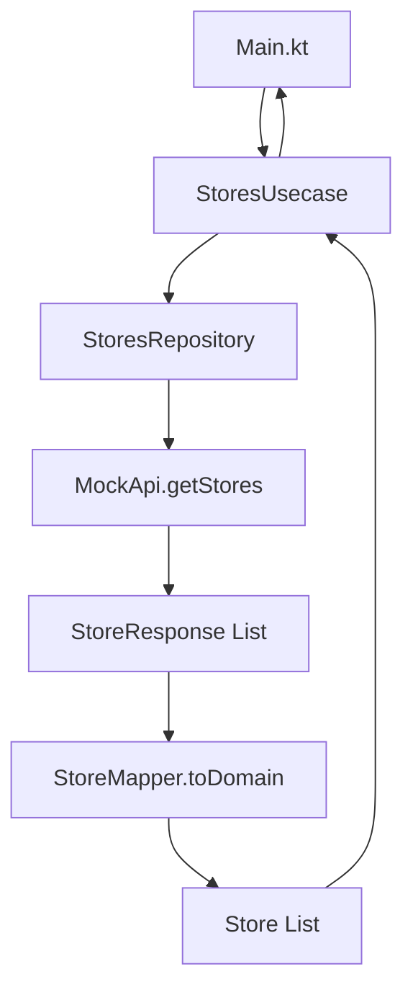

# m4l4_api_domain

Учебный пример архитектуры API и Domain слоёв в Kotlin с демонстрацией чистой архитектуры и правильного маппинга данных.

Проект разработан для курса **KMP от компании X5 Tech** и создан с помощью плагина **superpowers для opencode**.


## 📋 Содержание

- [Архитектура](#архитектура)
- [Стек технологий](#стек-технологий)
- [Установка и запуск](#установка-и-запуск)
- [Структура проекта](#структура-проекта)
- [Поток данных](#поток-данных)
- [Документация](#документация)
- [Учебные цели](#учебные-цели)
- [Лицензия](#лицензия)

## 🏗️ Архитектура

Проект демонстрирует двухслойную архитектуру с четким разделением ответственности:

### API Layer
- **Цель**: Обработка данных из внешних источников (REST API, JSON)
- **Характеристики**: DTO модели с примитивными типами, аннотации `@Serializable`
- **Компоненты**: `StoreResponse`, `MockApi`, `StoresRepository`, `StoreMapper`

### Domain Layer
- **Цель**: Бизнес-логика и сущности приложения
- **Характеристики**: Type-safe value objects, enum-ы, строгая типизация
- **Компоненты**: `Store`, `StringId`, `TSType`, `StoresUsecase`

### Диаграмма поток данных



**Последовательность выполнения:**
1. `Main.kt` → Создает и вызывает `StoresUsecase`
2. `StoresUsecase` → Вызывает `StoresRepository.getStores()`
3. `StoresRepository` → Получает данные из `MockApi`
4. `MockApi` → Возвращает моковый `List<StoreResponse>`
5. `StoreMapper` → Преобразует `StoreResponse` в `Store`
6. `StoresUsecase` → Возвращает готовый `List<Store>`
7. `Main.kt` → Выводит результат в консоль

## 💻 Стек технологий

| Технология | Версия | Назначение |
|------------|--------|------------|
| **Kotlin** | 2.2.21 | Основной язык разработки |
| **kotlinx.serialization** | 1.10.0 | Сериализация/десериализация JSON |
| **Gradle** | Kotlin DSL | Система сборки |
| **JVM Toolchain** | Java 17+ | Среда выполнения |

## 🚀 Установка и запуск

### Клонирование репозитория

```bash
git clone <repository-url>
cd m4l4_api_domain
```

### Сборка проекта

```bash
./gradlew clean build
```

### Запуск приложения

**Через Gradle:**
```bash
./gradlew run
```

**Через IntelliJ IDEA:**
1. Открыть проект в IDEA
2. Найти файл `src/main/kotlin/ru/x5/stores/Main.kt`
3. Нажать кнопку **Run** рядом с функцией `main()`

### Ожидаемый вывод

```
=== Магазины ===

ID: store-001
Название: Пятерочка - Тверская
Адрес: г. Москва, ул. Тверская, 1
ТС: TSX

ID: store-002
Название: Перекресток - Арбат
Адрес: г. Москва, ул. Арбат, 5
ТС: TS5

ID: store-003
Название: Чижик - Садовая
Адрес: г. Москва, ул. Садовая, 3
ТС: TSC

Всего магазинов: 3
```

## 📁 Структура проекта

```
m4l4_api_domain/
├── src/
│   └── main/
│       └── kotlin/
│           └── ru/x5/stores/
│               ├── Main.kt                           # Точка входа
│               ├── api/                              # API Layer
│               │   ├── model/
│               │   │   └── StoreResponse.kt          # DTO для внешнего API
│               │   ├── repository/
│               │   │   └── StoresRepository.kt        # Абстракция данных
│               │   ├── mapper/
│               │   │   └── StoreMapper.kt            # API → Domain маппинг
│               │   └── mocks/
│               │       └── MockApi.kt                # Mock данные
│               └── domain/                           # Domain Layer
│                   ├── model/
│                   │   ├── Store.kt                  # Бизнес-модель магазина
│                   │   ├── StringId.kt               # Value object для ID
│                   │   └── TSType.kt                 # Enum для тех. статуса
│                   └── usecase/
│                       └── StoresUsecase.kt          # Оркестратор бизнес-логики
├── docs/
│   └── superpowers/                                   # Документация (ниже)
├── build.gradle.kts                                    # Gradle конфигурация
├── settings.gradle.kts                                 # Gradle настройки
├── LICENSE                                             # MIT License
└── README.md                                           # Этот файл
```

### Описание компонентов

| Компонент | Пакет | Тип | Описание |
|----------|--------|-----|----------|
| **StoreResponse** | `ru.x5.stores.api.model` | Data class | DTO модель с `@Serializable` для десериализации JSON |
| **Store** | `ru.x5.stores.domain.model` | Data class | Бизнес-модель магазина с типобезопасными полями |
| **StringId** | `ru.x5.stores.domain.model` | Value class | Обертка над String для строгой типизации идентификаторов |
| **TSType** | `ru.x5.stores.domain.model` | Enum | Тип технического статуса (TSX, TS5, TSC) |
| **StoreMapper** | `ru.x5.stores.api.mapper` | Class | Конвертирует `StoreResponse` → `Store` |
| **StoresRepository** | `ru.x5.stores.api.repository` | Class | Абстракция источника данных |
| **MockApi** | `ru.x5.stores.api.mocks` | Object | Моковая реализация API для учебных целей |
| **StoresUsecase** | `ru.x5.stores.domain.usecase` | Class | Оркестратор бизнес-логики |

## 📚 Документация

Проект разработан с использованием плагина **superpowers для opencode**, который помогает автоматизировать разработку через AI-агнентов.

### 📋 Спецификации

Полная документация архитектуры и дизайна проекта:

- **[📄 Дизайн-спецификация API и Domain моделей](docs/superpowers/specs/2026-03-24-api-domain-models-design.md)**  
  *211 строк* — полное описание архитектуры, структуры пакетов, моделей, слоев и потока данных проекта.

### 📝 Планы реализации

Детальные пошаговые планы с чеклистами для отслеживания прогресса:

- **[🔧 План реализации API и Domain моделей](docs/superpowers/plans/2026-03-24-api-domain-models-implementation.md)**  
  *470 строк* — пошаговый план создания всех компонентов проекта: от настройки Gradle до финальной проверки.

- **[🔄 План миграции пакетов org.example → ru.x5.stores](docs/superpowers/plans/2026-03-24-package-migration-ru.x5.stores.md)**  
  *945 строк* — детальная стратегия переименования пакетов для соответствия стандартам компании X5 Retail Group, включая диагностику и устранение проблем.

## 🎯 Учебные цели

Проект демонстрирует лучшие практики разработки на Kotlin:

✅ **Разделение слоёв** — чистое разделение API и Domain слоёв  
✅ **Сериализация** — использование `@Serializable` для API моделей  
✅ **Type безопасность** — создание Type-safe value objects (`StringId`)  
✅ **Enum-ы** — использование enum для строгой типизации (`TSType`)  
✅ **Маппинг данных** — правильный маппинг между слоями через `StoreMapper`  
✅ **Оркестрация** — управление бизнес-логикой через `StoresUsecase`  
✅ **Чистая архитектура** — без смешения ответственности между слоями  

## 📄 Лицензия

Проект распространяется под лицензией [MIT License](LICENSE). Код свободен для любого использования.

```
Copyright © 2026 alexeenkoff
```

---

**Разработано для курса KMP от компании X5 Tech**  
**Создано с помощью плагина superpowers для opencode**
